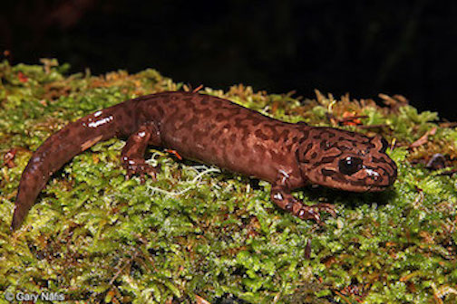

<center>
## Pacific Giant Salamander Weight and Abundance at Mack Creek
</center>
#### Leana Goetze
#### 12/4/2019

```{r setup, include=FALSE}
knitr::opts_chunk$set(echo = FALSE , message = FALSE, warning = FALSE)
```

```{r}
#attach libraries and read in data, filtering to only keep data on Pacific Giant salamanders. Change names to lowercase_snake_case
library(tidyverse)
library(janitor)
library(tidyr)
library(kableExtra)
library(ggbeeswarm)

salamander <- read_csv("mack_creek_vertebrates.csv") %>% 
  filter(SPECIES == "DITE") %>% 
  janitor::clean_names()
```


<center>
</center>

### I. Introduction
### II. Data and Methods
INCLUDE PICTURE
### III. Results

##### A. *Salamander Abundance in Old Growth and Clear Cut Sections of Mack Creek*

```{r}
# Group data by section of Mack Creek and count total salamanders observed per year
salamander_location <- salamander %>% 
  select(year, section) %>% 
  count(year, section)
```

```{r}
# Graph the Salamander counts in old growth and clear cut sections of Mack Creek between 1993-2017
ggplot(salamander_location, aes (x = year, y =n, group = section))+
  geom_line(aes(color = section), show.legend = FALSE)+
  geom_point(aes(color = section), show.legend = FALSE)+
  scale_color_manual(values=c("#72D58D","#225831"))+
  theme_minimal()+
  labs(x = "Year", y = "Salamander Count", title= "Mack Creek Salamander Abundance \n (Clear Cut vs. Old Growth)")+
  theme(plot.title = element_text(hjust= 0.5,
                                  face = "bold",
                                  size = 16,
                                  margin=margin(0,0,10,0)))+
  theme(axis.title.x = element_text (face = "bold",
                                     size = 14,
                                     margin=margin(10,0,0,0))) +
  theme(axis.title.y = element_text (face = "bold",
                                     size = 14,
                                     margin=margin(0,10,0,0)))+
  annotate("text", x = 2018.6, y = 368, label = "Clear Cut", size = 3, color = "#72D58D")+
  annotate("text", x = 2018.8, y = 328, label = "Old Growth", size = 3, color = "#225831")+
  scale_x_continuous(limits=c(1990,2019), breaks = seq(1190, 2019, by=5)) 

```
**Figure 1:Abundance of pacific giant salamander in clear cut and old growth sections of Mack Creek over time.** Counts obtained annually from 150 m reaches of stream. Points indicate individual counts obtained. Old growth forested sections of Mack Creek are represented by dark green, while light green represents counts from clear cut sections of Mack Creek. Data Source: [Aquatic Vertebrate Population Study in Mack Creek](https://portal.lternet.edu/nis/mapbrowse?packageid=knb-lter-and.4027.12)

Salamander abundance at both old growth and clear cut sections of Mack Creek appear to follow the same trends. [DATA TRENDS]

##### B. *Salamander Abundance by Channel Type* 

**Table 1. Salamander Abundance by Channel Type in Clear Cut and Old Growth sections of Mack Creek**
```{r}
# Only keep observations from 2017. Sort by cascade, pool, and side-channel observations for both the clear cut and old growth sections of  Mack Creek (removing isolated pools data).
salamander_2017<- salamander %>% 
  filter(year == "2017") %>% 
  select(year, unittype, section) %>% 
  filter (unittype %in% c("SC", "C", "P")) %>% 
  count(unittype, section)

# Rearrange data using pivot_wider so that clear cut and old growth are there own columns
salamander_2017_table <- salamander_2017 %>% 
  pivot_wider(names_from = section, values_from = n)

# Rename observations
salamander_2017_table$unittype[salamander_2017_table$unittype == "C"] <-"Cascade"
salamander_2017_table$unittype[salamander_2017_table$unittype == "P"] <-"Pool"
salamander_2017_table$unittype[salamander_2017_table$unittype == "SC"] <-"Side-channel"

# Calculate percentages, and rename columns
salamander_2017_perc <- salamander_2017_table %>% 
  janitor::adorn_percentages(denominator = "col") 

salamander_2017_table_perc <- salamander_2017_table %>% 
  janitor::adorn_percentages(denominator = "col") %>% 
  adorn_pct_formatting(digits = 0) %>% 
  adorn_ns(position = "front") %>% 
  rename("Clear Cut" = CC) %>% 
  rename( "Old Growth" = OG) %>% 
  rename ("Channel Type" = unittype)

#create a nicer table using kable function
kable(salamander_2017_table_perc) %>% 
  kable_styling() %>% 
  kable_styling(bootstrap_options = "bordered", 
                full_width = F,
                position = "left") %>% 
  row_spec(1, background = "#EAF1FB") %>% 
  row_spec(2, background = "#CCD5E1") %>%
  row_spec(3, background = "#AFB9C6")

# QUESTION: GET PERCENTAGE BY ROW OR COLUMN??
```

##### C. *Salamander Abundance by Channel Type* 
```{r}
# Is there a significant effect of forest condition (old growth or clear cut) on where in the channel salamanders are found (channel classification)? Run a chi test to test for this b/c chi tests are used to compare proportions/count data. 
salamander_chi_data <- salamander_2017_table%>% 
  select(-"unittype")

salamander_chi_test <- chisq.test(salamander_chi_data)

# salamander_chi_test

# p-value > .05 so retain the null, meaning there is NO significant difference between forest condition and where in the channel salamanders are found. 

```

There is not a significant effect of forest condition, either old growth or clear cut, on Salamander abundance across cascades, side-channels, or pools ($\chi$^2^(`r salamander_chi_test$parameter`)=`r round(salamander_chi_test$statistic, 2)`, *p* = `r round (salamander_chi_test$p.value,2)`). At `r round(salamander_2017_perc$CC[1]*100,0)`% and `r round(salamander_2017_perc$OG[1]*100,0)`%, the majority of Salamanders from both clear cut and old growth sections of Mack Creek were found at Cascades. Side-channels accounted for the next greatest abundance of the salamanders from both sections sampled (`r round(salamander_2017_perc$CC[3]*100,0)`% and `r round(salamander_2017_perc$OG[3]*100,0)`% repectively). Pools contained the fewest amount of salamanders accross both sections of Mack Creek, accounting for only `r round(salamander_2017_perc$CC[2]*100,0)`% and `r round(salamander_2017_perc$OG[2]*100,0)`% of salamanders observed. 

##### D. *Salamander Weights accross clear cut and old growth forest sections (2017)* 
```{r}
# Find the mean weight of salamanders in both the clear cut and old growth sections of the creek in 2017. Remove "NA" values
salamander_weight <- salamander %>% 
  filter(year == "2017") %>% 
  select(section, weight) %>% 
  group_by(section) %>% 
  summarize(mean_weight = mean(weight,na.rm = TRUE ))
```

```{r}
# Is there a significant difference in mean weights for Pacific giant salamanders observed in the two forest sections (clear cut and old growth) in 2017? Okay to use t-test, because under the central limit theorem, the means of the samples will be normally distributed because these are large enough sample sizes AND using a welch's t-test does not assume equal variance.  
weight_2017 <- salamander %>% 
  filter(year == "2017") %>% 
  select(weight, section)

cc_weight_2017 <- weight_2017 %>% 
  filter(section == "CC") %>% 
  pull(weight)
  
og_weight_2017 <- weight_2017 %>% 
  filter(section == "OG") %>% 
  pull(weight)

cc_og_weights_ttest_2017 <- t.test(cc_weight_2017, og_weight_2017)
#cc_og_weights_ttest_2017 

# test for effect size
cc_og_weights_2017_d <- effsize::cohen.d(cc_weight_2017, og_weight_2017, na.rm = TRUE)

#cc_og_weights_2017_d

# p-value > .05 so means of salamanders from clear cut and old growth sections did not differ significantly.Effect size is negligable
```

Salamanders measured from clear cut and old growth forested sections of Mack Creek did not significantly differ in weight (t(`r round(cc_og_weights_ttest_2017$parameter, 2)`)) = `r round(cc_og_weights_ttest_2017$statistic, 2)`, *p* = `r round(cc_og_weights_ttest_2017$p.value, 2)`), with a negligible effect size (Cohen’s d = `r round(cc_og_weights_2017_d$estimate[1],2)`).[ADD MORE]

```{r}
salamander_summary <- salamander %>% 
  filter(year == "2017") %>% 
  select(section, weight) %>% 
  group_by(section) %>% 
  summarize(mean_weight = mean(weight, na.rm = TRUE),
    sd_weight = sd(weight, na.rm = TRUE),
    sample_size = n(),
    se_weight = sd(weight, na.rm = TRUE) / sqrt(n()),
    var_weight = var(weight, na.rm = TRUE))
```

```{r}
# Make graph (optional)
salamander_density <- salamander %>% 
  select(section, year, weight) %>% 
  filter(year == "2017")

ggplot(salamander_density, aes(x = weight, group = section, fill = section))+
  geom_density(alpha = .3)+
  scale_fill_manual( values = c("#72D58D", "#225831"))+
  geom_vline(data = salamander_weight, aes(xintercept= mean_weight, color = section), show.legend = FALSE, linetype = "dashed", size = .5)+
  scale_color_manual( values = c("#72D58D", "#225831"))+
  scale_y_continuous( expand = c(0,0))+
  scale_x_continuous( expand = c(0,0))
```
**Figure 2:XX.**Data Source: [Aquatic Vertebrate Population Study in Mack Creek](https://portal.lternet.edu/nis/mapbrowse?packageid=knb-lter-and.4027.12)

##### E. *Salamander Weights by channel type in clear cut and old growth forest sections (2017)*  
```{r, fig.height = 7}
# QUESTION: DOES IT MAKE SENSE TO HAVE SD BARS EXTEND BELOW ZERO?
# QUESTION: how to choose between SD, standard error, or 95 % confidence interval?

# Keep 2017 weight observations for the three channel types 
salamander_channels <- salamander %>% 
filter(year == "2017") %>% 
select(weight, unittype) %>% 
filter(unittype %in% c("SC", "C","P"))

# Sort by channel type and summary statistics in regards to weight
salamander_channels_summary <- salamander_channels %>% 
group_by(unittype) %>% 
summarize(mean_weight = mean(weight, na.rm = TRUE),
    sd_weight = sd(weight, na.rm = TRUE),
    sample_size = n(),
    se_weight = sd(weight, na.rm = TRUE) / sqrt(n()),
    var_weight = var(weight, na.rm = TRUE))

# Make plot to visually compare Pacific giant salamander weights between the three channels
ggplot()+
geom_beeswarm(data = salamander_channels, aes(x = unittype, y = weight), size = 1.2, alpha = .7,pch = 16, color = "#4D6483")+
scale_x_discrete (labels = c("Cascade", "Pool", "Side-channel"))+
labs(x = "Salamander Location", y = "Salamander Weight (grams)", title = "Weight Distribution of Salamanders \n at Varying Channel Locations")+
geom_point(data = salamander_channels_summary, aes(x=unittype, y= mean_weight), color = "maroon", size = 3)+
geom_errorbar(data = salamander_channels_summary, 
                aes(x = unittype, 
                    ymin = mean_weight - sd_weight,
                    ymax = mean_weight + sd_weight),
                color = "maroon",
                width = 0.1) +
  theme_light()+
  theme(plot.title = element_text(hjust= 0.5,
                                  face = "bold",
                                  size = 16,
                                  margin=margin(0,0,10,0)))+
  theme(axis.title.x = element_text (face = "bold",
                                     size = 14,
                                     margin=margin(10,0,0,0))) +
  theme(axis.title.y = element_text (face = "bold",
                                     size = 14,
                                     margin=margin(0,10,0,0)))

# notice outliers in data--> suggest that it might be better to use median as a metric for comparison.

```
**Figure 3:Pacific giant salamander weights taken at cascades, pools, and side-channels of Mack Creek.** Gray points indicate individual salamander weights, measured in grams. Larger maroon points indicate sample means, and error bars indicate $\pm$ 1 standard deviation. Data Source: [Aquatic Vertebrate Population Study in Mack Creek](https://portal.lternet.edu/nis/mapbrowse?packageid=knb-lter-and.4027.12)


```{R}
#Is there a significant difference in mean weights for Pacific giant salamanders observed in pools vs. cascades vs. side-channels in 2017? 

# Check for normality with histogram plot
##ggplot(salamander_channels, aes (x = weight))+
 ## geom_histogram()+
  ##facet_wrap(~unittype)

# does not look normally distributed, but central limit theorem tells us that the means will be normally distributed (because large sample sizes).

#Check for normality with qq plot
##ggplot(data = salamander_channels, aes(sample = weight)) +
 ## geom_qq(aes(color = unittype),
                 ##alpha = 0.5,
                 ##show.legend = FALSE) +
  ##facet_wrap(~unittype, scales = "free")

# Does still not normally distributed, but large sample sizes so the central limit theorem tells us that the means will still be normally distributed

# Run levenes statistical test to test for equal variance
#leveneTest(weight ~ unittype, data = salamander_channels)

# p value > .05 so we retain the null hypothesis of equal variances

# since we know that the means are normally distributed, and we can assume equal variance, and observations are likely to be independent of one another,  we proceed with a one-way-ANOVA test to compare group means.

# Run one-way ANOVA
salamander_anova <- aov(weight ~ unittype, data = salamander_channels)

#summary(salamander_anova)

# p value <.01 so we have sufficient evidence to reject the null hypothesis that mean weights are the same across all channel types. 

# Run Tukey test to find out which combinations of channel types significantly differ in mean salamander weights
#TukeyHSD(salamander_anova)

#P-C do not differ significantly, SC-C do not differ significantly, SC-P DO differ significantly
```

An additional method for comparing salamander weights across the three channel types would be to compare ranks of the measured weights using a Kruskal Willis statistical test. This is often thought of as a comparison of means, and is appropriate for this dataset because there are many outliers. Since skew and outliers have more of an effect on mean, comparing medians may make for a more appropriate comparison of Salamander weights across the three Mack Creek channel types. 

### IV. Results

### References

**Gregory S. V. 2016.** Aquatic Vertebrate Population Study in Mack Creek, Andrews Experimental Forest, 1987 to present. Environmental Data Initiative. https://doi.org/10.6073/pasta/5de64af9c11579266ef20da2ff32f702. Dataset accessed 11/24/2019.
